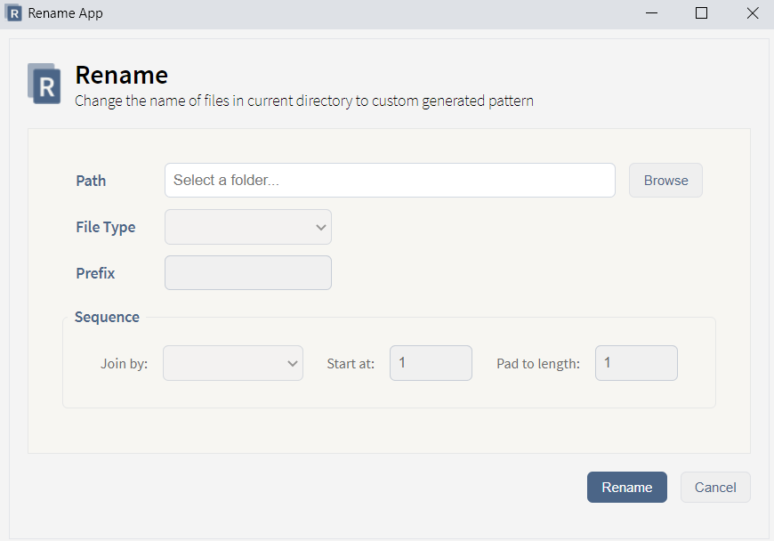

# Rename App

This app allows to rename multiple files in selected folder using the name structure specified. It's a desktop app, built using [NW.js](https://nwjs.io/).

This is one project in a series of tools that I am building, whether for daily use or just for the fun of learning something new.

## Features

- Folder explorer.
- Selection by file type.
- Custom prefix and suffix sequence (connector, starting number and pad to length using leading zeros).

## Let's chat!

I love learning new stuff, so any comments or suggestions are most welcomed.

Also, I love coffee. If you are around, we might try to do one those virtual coffee hangouts (it's totally a thing). Just hit me up!
